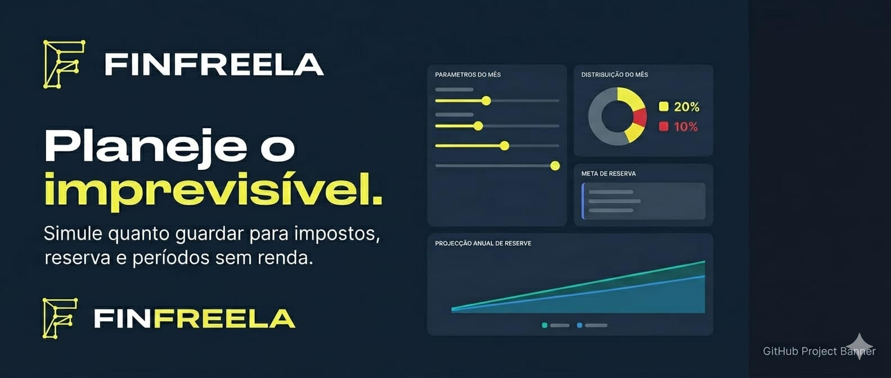
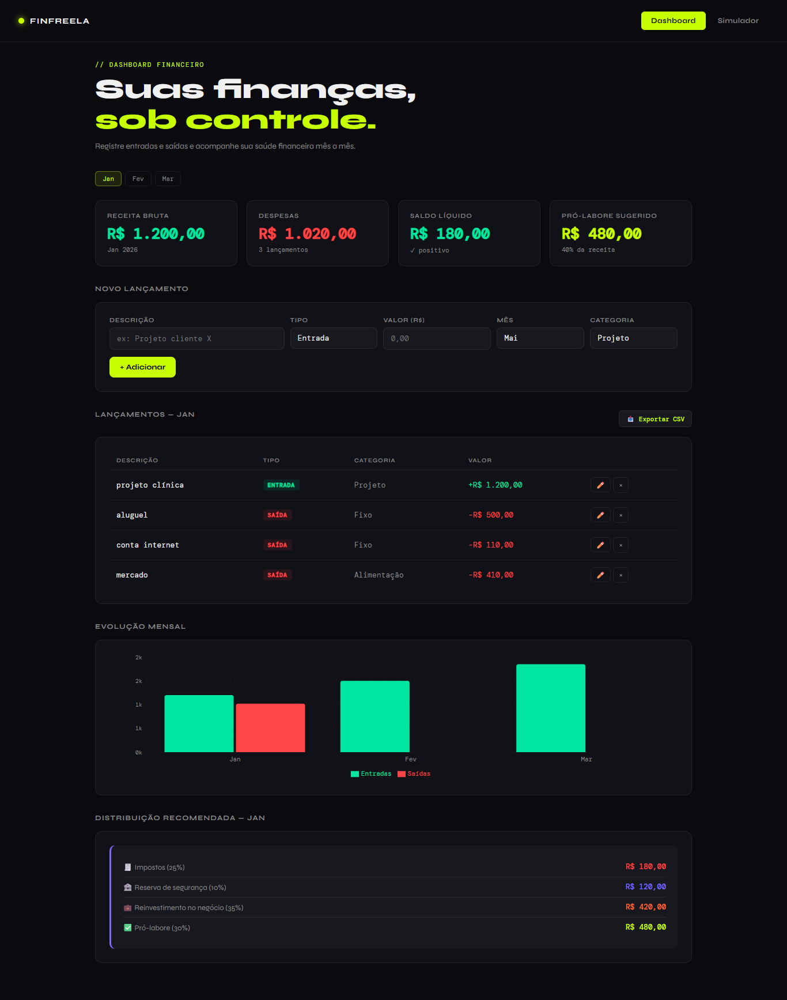
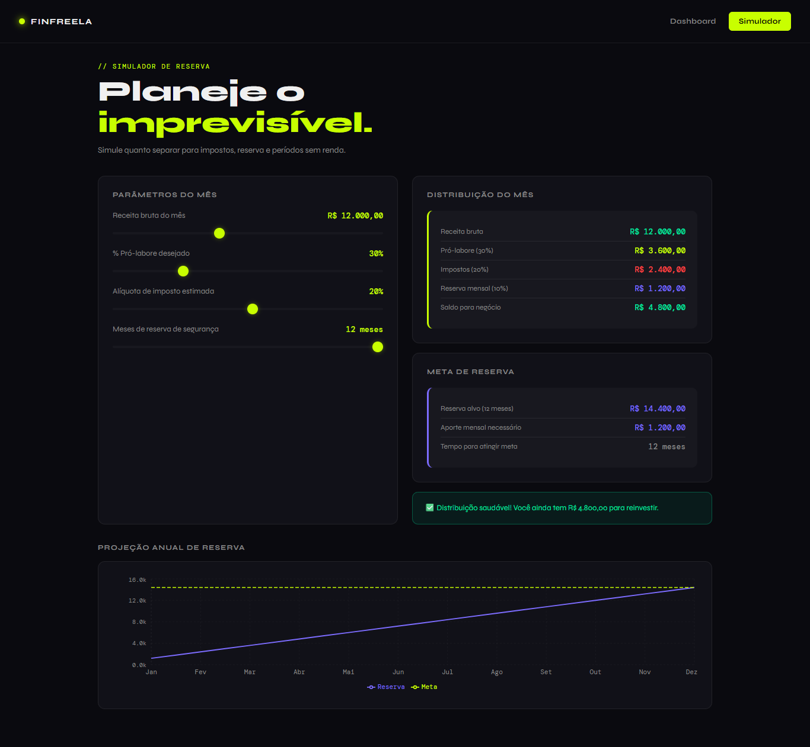

<div align="center">



# 💼 FinFreela — Educador Financeiro Inteligente


**🔗 [Ver demonstração ao vivo](https://alananjos06.github.io/educador-financeiro-inteligente/)**

</div>

---

## 📸 Demonstração

| Dashboard | Simulador |
|-----------|-----------|
|  |  |

---

## Sobre o projeto:
O **FinFreela** é uma aplicação React voltada para freelancers e pequenos empreendedores com renda variável. Ele resolve um problema real: a falta de uma ferramenta financeira funcional que respeita a irregularidade da receita de quem trabalha por conta própria.

---

## Funcionalidades:

### Dashboard
- Registro de entradas e saídas por mês
- Filtro por mês com visualização de saldo líquido
- Cálculo automático de pró-labore sugerido (40% da receita)
- Distribuição recomendada: impostos, reserva, reinvestimento e pró-labore
- Gráfico de barras com evolução mensal (Recharts)
- ✅ **Edição dos lançamentos (✏️)**
- ✅ **Exportação de dados para CSV (📥)**
- ✅ **Categorias personalizáveis**

### Simulador de Reserva
- Sliders interativos para receita, % pró-labore, alíquota de imposto e meses de reserva
- Cálculo em tempo real de toda a distribuição financeira
- Alerta inteligente: saudável / apertado / negativo
- Gráfico de projeção anual da reserva de segurança

---

## Tecnologias Utilizadas:

| Tecnologia | Descrição |
|------------|-----------|
| **React 18** | Componentização e hooks (useState, useMemo, useEffect) |
| **Vite** | Bundler e servidor de desenvolvimento |
| **Recharts** | Gráficos interativos |
| **CSS Modules** | Estilização isolada por componente |
| **LocalStorage** | Persistência de dados local |
| **GitHub Pages** | Hospedagem do site |

---

## Estrutura do projeto:
```bash
src/
├── components/
│ ├── Header.jsx / Header.module.css
│ ├── Dashboard.jsx / Dashboard.module.css
│ └── Simulador.jsx / Simulador.module.css
├── hooks/
│ └── useEntries.js ← custom hook + localStorage
├── App.jsx / App.module.css
├── main.jsx
├── index.css
└── utils.js ← formatação e cálculos
```
---

## 🚀 Como rodar localmente

```bash
# Clone o repositório
git clone https://github.com/alananjos06/educador-financeiro-inteligente.git

# Acesse a pasta
cd educador-financeiro-inteligente

# Instale as dependências
npm install

# Inicie o servidor de desenvolvimento
npm run dev

# Build para produção
npm run build
```
📦 Deploy:<br>
O projeto está hospedado no GitHub Pages e é atualizado automaticamente via push na branch main.

```bash
npm run build
git add docs/
git commit -m "deploy: nova versão"
git push origin main
```
---

📝 Licença:<br>
Projeto desenvolvido como parte de um desafio do Bootcamp Santander 2026 AI React Front-End da DIO.

<div align="center"> Criado com 💚 por Alana Anjos · React + Vite · Bootcamp Santander 2026 </div>
